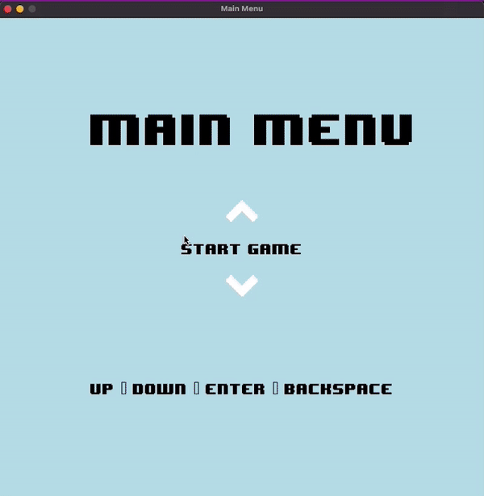
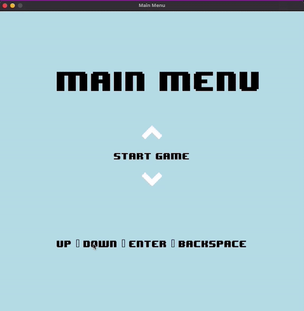

# CHECKERS GAME
---

## Description
---

This game is a traditional 8 x 8 checkers game with similar rules to the original game, except a few differences. Below is a summary of the game rules.

1. Each player starts with 12 pieces on the board.
2. Players alternate turns moving their pieces.
3. Pieces move diagonally to an adjacent empty square.
4. If an opponent's piece is in the next square and an empty square is behind it, the player must capture the opponent's piece by jumping over it.
5. When a piece reaches the opponent's side of the board, it becomes a king.
6. Kings can move and capture pieces both forward and backward.
7. Game ends when one player has no pieces left or cannot make a legal move.
8. If an ordinary piece captures a king, the piece gets promoted to a king.
9. Force capture is compulsory, in the case where the opponents piece is available for capture, that's the only valid piece on the board for the current player.

<table>
    <tr>
        <td></td>
        <td></td>
    </tr>
</table>


## How to run the code
---

First install Requirements

```
pip3 install -r requirements.txt
```

### Run the Game
--- 

```bash
python3 main.py
```

**You can tweak the parameters of the game bot from [main](main.py) file**

## Conclusion
--- 

1. Heuristics can be drastically improved by adding specific features.
2. The depth of the game tree has a significant influence on the quality of the computer player.
3. There's a tradeoff between calculation time and quality of the game.
4. It is not efficient to use Minimax without optimizations while with them it can be a good solution.
5. Alpha-Beta pruning is exponentially improving in comparison to Minimax as the depth grows.
6. Certain heuristics are clearly better than others but some of the “bad” ones still work well in some cases.

## References
---

1. To read more about the rules and how to play the game of checkers, click [here](http://www.itsyourturn.com/t_helptopic2030.html)

## Contributing
---

Found a bug? Create an **[issue](https://github.com/d1m3j1/Checkers/issues/new)**.